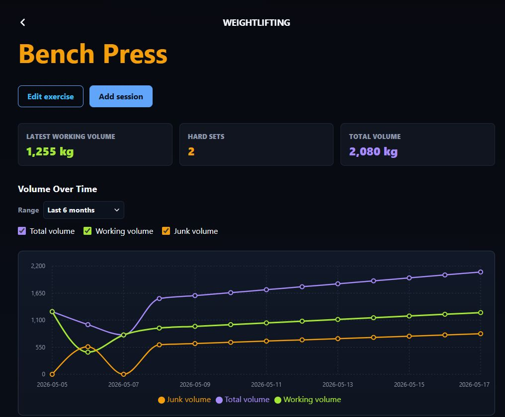
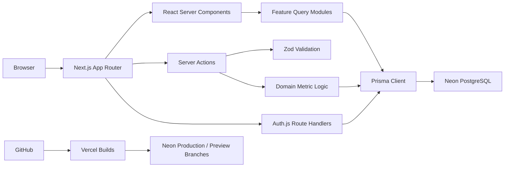

# Workout Trackr

Workout Trackr is a commercial, production-oriented full-stack performance
tracking application built with Next.js, PostgreSQL, and Prisma. It records
structured weightlifting and pace-based training data, calculates derived
metrics on the server, and presents session history as evidence that can guide
future training decisions.

The project is also an engineering case study in modernizing a MERN application
into a server-first Next.js architecture with relational data modeling,
database-backed authentication, explicit validation, and an environment-aware
deployment workflow.



## Engineering Focus

- Server Components for authenticated, read-heavy application screens.
- Server Actions for application-owned mutations.
- Database-level ownership filters on every user-owned query and mutation.
- Zod validation at server boundaries.
- Server-calculated metrics instead of trusting derived client input.
- Relational constraints and cascading deletes for domain integrity.
- Database-backed Auth.js sessions with Google OAuth.
- Isolated Neon branches for local development, Preview deployments, and
  Production.
- Forward-only Prisma migrations deployed automatically during Vercel builds.
- Focused unit and database integration tests for domain and authorization
  behavior.

## Product Scope

Authenticated users can:

- Organize training into logs and exercises.
- Record weightlifting sessions with ordered sets, repetitions, weight, and
  hard-set classification.
- Record pace sessions with duration and distance.
- Review paginated session history and previous-session evidence.
- Analyze working volume, total volume, junk volume, pace, speed, and distance.
- Filter progress charts by predefined or custom date ranges.
- Update their profile and securely end database sessions.

## Architecture



The application is organized by responsibility:

- `app/` defines public, authentication, authenticated, and API routes.
- `features/` owns domain schemas, calculations, queries, actions, and focused
  UI.
- `components/` contains reusable application and navigation components.
- `lib/` contains cross-cutting auth, environment, database, redirect, and
  metadata utilities.
- `prisma/` contains the relational schema and forward migrations.

Server Components call query modules directly. Mutations flow through Server
Actions, where the user is authenticated, input is parsed, ownership is checked,
derived values are recalculated, and related writes are committed in a
transaction where necessary. CRUD behavior is not duplicated behind an
application-internal JSON API.

## Technology

| Area | Implementation |
| --- | --- |
| Application | Next.js 16 App Router, React 19, TypeScript |
| Database | PostgreSQL hosted on Neon |
| ORM and migrations | Prisma 7 and Prisma Migrate |
| Authentication | Auth.js 5, Prisma Adapter, Google OAuth, database sessions |
| Validation | Zod 4 |
| Charts | Recharts 3 |
| Testing | Vitest, Prisma-backed integration tests |
| Deployment | Vercel with Neon branch-per-Preview integration |
| Runtime | Node.js 24 |

## Data Model

The core hierarchy is:

```text
User
└── Log
    └── Exercise (WEIGHTLIFTING or PACE)
        ├── WeightliftingSession
        │   └── WeightliftingSet
        └── PaceSession
```

Auth.js `Account` and `Session` records belong to the same `User` model as the
training data. Logs use user-scoped slugs, exercises use log-scoped slugs, and
sessions use stable database identifiers. This avoids cross-user slug conflicts
and same-date session collisions.

Derived metrics are persisted as PostgreSQL decimal values after being computed
on the server:

- Set volume: `repetitions * kilograms`
- Working volume: sum of hard-set volume
- Junk volume: sum of non-hard-set volume
- Pace: elapsed minutes divided by distance
- Speed: distance divided by elapsed time

## Security Model

- Every user-owned Prisma query includes the authenticated user identifier.
- Nested mutations verify ownership of their parent log and exercise.
- Auth.js stores sessions in PostgreSQL and uses secure HTTP-only cookies.
- Callback destinations are restricted to relative application paths.
- Preview deployments disable Google sign-in by default.
- Server errors are logged without form values, credentials, tokens, or database
  connection strings.
- Production responses include CSP, HSTS, framing, MIME-sniffing, referrer,
  permissions, and opener-isolation headers.
- Environment configuration is validated at startup, including minimum secret
  length and Production-only OAuth requirements.

## Development Setup

### Prerequisites

- Node.js 24
- npm
- A Neon PostgreSQL project with a development branch
- A Google OAuth web client for local authentication

### Installation

```bash
git clone https://github.com/VasileiosZisis/workout-tracker-nextjs.postgresql.git
cd workout-tracker-nextjs.postgresql
npm install
cp .env.example .env
```

Configure `.env` with a pooled Neon development connection in `DATABASE_URL`,
the corresponding unpooled connection in `DIRECT_URL`, a local `AUTH_SECRET`,
and local Google OAuth credentials.

Create or apply the development migrations, then start the application:

```bash
npm run prisma:migrate
npm run dev
```

The local Google OAuth client should use:

```text
Origin:   http://localhost:3000
Callback: http://localhost:3000/api/auth/callback/google
```

## Environment Variables

| Variable | Purpose |
| --- | --- |
| `NEXT_PUBLIC_APP_URL` | Stable application origin for local OAuth and Production metadata |
| `AUTH_SECRET` | Environment-specific Auth.js secret of at least 32 characters |
| `AUTH_GOOGLE_ID` | Google OAuth client identifier |
| `AUTH_GOOGLE_SECRET` | Google OAuth client secret |
| `DATABASE_URL` | Pooled PostgreSQL connection used by the application |
| `DIRECT_URL` | Local unpooled connection used by Prisma migrations |
| `DATABASE_URL_UNPOOLED` | Vercel unpooled migration connection supplied by Neon |

Secrets and Production database URLs are never committed. Local, Preview, and
Production environments use separate credentials.

## Quality Checks

The complete local verification pipeline is:

```bash
npm run check
npm run prisma:validate
```

`npm run check` runs ESLint, TypeScript, the Vitest suite, Prisma Client
generation, and an optimized Next.js production build. Tests cover pure metric
logic, validation schemas, slug and pagination helpers, environment policy,
safe redirects, ownership-scoped database queries, and Server Action behavior.

Useful individual commands:

| Command | Purpose |
| --- | --- |
| `npm run lint` | Run ESLint |
| `npm run typecheck` | Run TypeScript without emitting files |
| `npm test` | Run the complete Vitest suite once |
| `npm run build` | Generate Prisma Client and build Next.js |
| `npm run prisma:validate` | Validate the Prisma schema and configuration |
| `npm run prisma:studio` | Inspect the configured development database |

## Deployment Workflow

The repository uses a three-environment database model:

| Environment | Database | Authentication |
| --- | --- | --- |
| Local | Long-lived Neon `development` branch | Local Google OAuth client |
| Preview | Disposable Neon branch created per deployment | Google OAuth disabled by default |
| Production | Primary Neon `production` branch | Production Google OAuth client |

Feature branches create Vercel Preview deployments and isolated Neon branches.
Merging into the configured production Git branch creates a fresh Production
deployment. The Vercel build runs `prisma migrate deploy` against the
environment's unpooled connection before generating Prisma Client and building
Next.js.

Database migrations are forward-only. Rolling back a Vercel deployment does not
reverse a migration that has already been applied.

## Current Constraints

- Google OAuth is the only v1 sign-in method.
- Weight and distance are stored and displayed in kilograms and kilometers.
- Preview authentication requires a future stable staging branch and dedicated
  OAuth client.
- Application-level rate limiting, external error tracking, and automated
  browser tests are not part of the current v1 scope.
- The rewrite intentionally starts with an empty PostgreSQL database; legacy
  MongoDB data migration is out of scope.

## Documentation

- [Project brief](docs/00-project-brief.md)
- [Architecture](docs/01-architecture.md)
- [Data model](docs/02-data-model.md)
- [Routing and Server Actions](docs/03-routing-and-actions.md)
- [Architecture decisions](docs/04-architecture-decisions.md)
- [Delivery history](docs/05-delivery-history.md)
- [Production runbook](docs/06-production-runbook.md)

## License

This public repository is available for portfolio review and technical
evaluation. The software is proprietary and `UNLICENSED`; no permission is
granted to copy, modify, distribute, or use it commercially.
