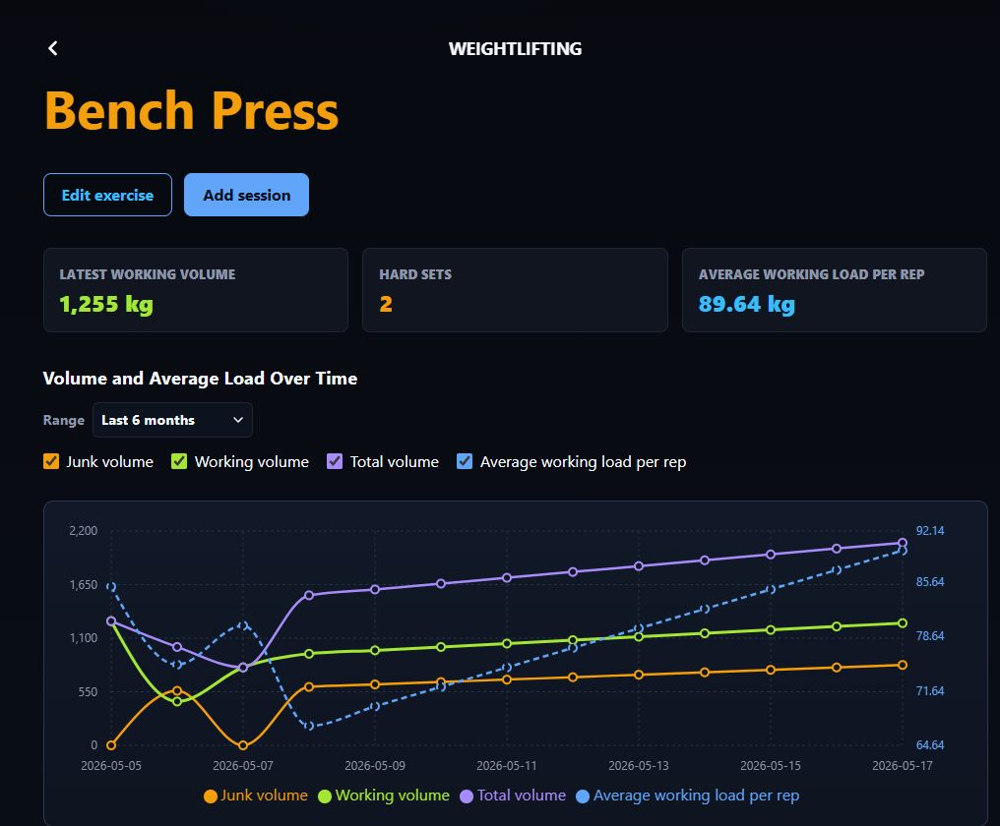
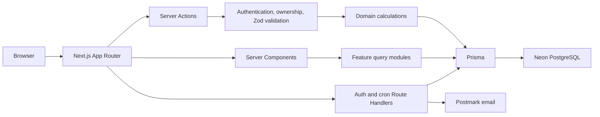

# Workout Trackr

Workout Trackr is a full-stack web app for recording strength, pace-based, and
interval training, then reviewing session history and progress. Users organize
exercises into logs, record structured measurements, and compare volume, load,
pace, speed, distance, and interval workload over time.

This repository modernizes an earlier MERN application into a Next.js App Router
and PostgreSQL system. It demonstrates work across interactive UI, relational
data modeling, authentication, authorization, domain calculations, integration
testing, and deployment operations. The architectural decisions and their
tradeoffs are linked below so reviewers can evaluate the implementation directly.

**[Live app](https://www.workouttrackr.com) ·
[Try the demo](https://www.workouttrackr.com/demo) ·
[Architecture decisions](docs/04-architecture-decisions.md)**



## Explore the demo

The demo provides an isolated, writable workspace without Google or email
sign-in. Each visitor receives sample strength, pace, and interval history.

A short walkthrough:

1. Open **Strength Training → Bench Press** to inspect sets, volume, and average
   working load. Change the chart range and inspect a historical session.
2. Open **Running → 5K Tempo Run** to compare pace, speed, and distance.
3. Open **Running → Track Sprints** to inspect interval protocols, total work,
   recovery, and block duration.
4. Create or edit a session to see validation and recalculated metrics, then
   exit the demo when finished.

Demo access expires after two hours. Signing out deletes the workspace; expired
workspaces are removed through session checks, new-demo creation, and scheduled
cleanup. Deletion is not guaranteed to occur at the exact expiry time. Demo
availability is controlled by `DEMO_ENABLED` and an active-workspace capacity
limit.

## What the app does

### Organize and record training

- Sign in with Google OAuth or a passwordless email link delivered by Postmark.
- Create, rename, and delete logs and exercises. Each exercise has one session
  kind: weightlifting, pace, or interval/HIIT.
- Create, edit, and delete dated sessions. Separate sessions can share a date.
- Record ordered weightlifting sets with repetitions, kilograms, and a
  user-selected hard-set flag.
- Record pace activities with hours, minutes, seconds, and distance in kilometers.
- Record uniform interval blocks with rounds, work duration, recovery duration,
  and optional recovery after the final round.

Deleting a log or exercise also deletes its dependent training records. An
exercise's session kind cannot be changed while it has recorded sessions.

### Review history and progress

- Review the latest session alongside paginated session history and detailed
  session pages.
- Inspect total, working, and non-hard-set volume, plus average working load.
  The interface labels non-hard-set volume as “junk volume”; this is a record
  classification, not an automatic assessment of training quality.
- Compare pace in min/km, speed in km/h, and distance over time.
- Switch interval charts between total work, rounds, block duration, and the
  numeric work:rest ratio.
- Filter charts by 4, 8, or 12 weeks, six months, one year, YTD, or a custom
  date range. Preset ranges are anchored to the exercise's latest session.
- Inspect chart details and accessible data tables in a mobile-first dark UI.

Interval charts describe workload and protocol changes. A higher work:rest ratio
or longer block does not automatically mean better performance.

The profile page displays the signed-in identity. Profile editing is not
implemented; signing out ends the current database-backed session.

## Technology

| Area | Implementation |
| --- | --- |
| Application | Next.js 16 App Router, React 19, TypeScript |
| UI and charts | Custom CSS, interactive Client Components, Recharts 3 |
| Database | PostgreSQL hosted on Neon |
| ORM and migrations | Prisma 7, PostgreSQL adapter, committed Prisma migrations |
| Authentication | Auth.js 5 beta, Prisma Adapter, Google OAuth, Postmark, database sessions |
| Validation | Zod 4 schemas at mutation boundaries |
| Tests | Vitest unit tests and Prisma-backed database integration tests |
| Deployment | Vercel, Neon branches, authenticated demo-cleanup cron |
| Runtime | Node.js 24 |

Exact dependency versions and available commands are in [package.json](package.json).

## Architecture


```mermaid
flowchart LR
  Browser[Browser] --> App[Next.js App Router]
  App --> RSC[Server Components]
  App --> Actions[Server Actions]
  App --> Routes[Auth and cron Route Handlers]
  RSC --> Queries[Feature query modules]
  Actions --> Validation[Authentication, ownership, Zod validation]
  Validation --> Metrics[Domain calculations]
  Metrics --> Prisma[Prisma]
  Queries --> Prisma
  Routes --> Prisma
  Routes --> Postmark[Postmark email]
  Prisma --> DB[Neon PostgreSQL]
```

Server Components read data directly through feature query modules. Server
Actions authenticate the caller, validate submitted input, resolve owned records,
calculate derived metrics, and persist changes. Weightlifting edits replace sets
and update session totals within one transaction. Client Components handle
interactive forms, charts, navigation, and confirmation controls.

Application CRUD is implemented through Server Actions. Route Handlers serve
Auth.js and scheduled cleanup; there is no separate public workout REST API.

### Decisions and code worth reviewing

| Decision | Reason and tradeoff | Implementation |
| --- | --- | --- |
| Server-first reads and mutations | Keeps database access and domain rules on the server; couples the app to Next.js conventions. | [Exercise page](app/(app)/logs/[logSlug]/exercises/[exerciseSlug]/page.tsx), [weightlifting actions](features/weightlifting/actions.ts) |
| PostgreSQL ownership and lifecycle relationships | Scoped uniqueness and cascades model naming and deletion rules; authorization and consistency across redundant parent IDs still need application checks. | [Prisma schema](prisma/schema.prisma), [exercise actions](features/exercises/actions.ts) |
| Persist server-calculated totals | Simplifies history reads; every create/edit path must recalculate totals consistently. Average working load and interval ratios remain derived on read. | [Weightlifting metrics](features/weightlifting/metrics.ts), [interval actions](features/interval/actions.ts), [chart mapping](features/progress/mapping.ts) |
| Database-backed authentication | Supports server-side session revocation and demo expiry; authentication depends on database availability. | [Auth configuration](auth.ts), [demo-aware adapter](lib/auth-adapter.ts) |
| Writable, temporary demo accounts | Lets visitors evaluate real mutations without personal sign-in; requires expiry enforcement, capacity limits, and cleanup. | [Demo service](features/demo/service.ts), [cleanup route](app/api/cron/demo-cleanup/route.ts) |
| Database branches per environment | Separates local and deployment databases; deployment rollback does not reverse database migrations. | [Prisma configuration](prisma.config.ts), [Vercel configuration](vercel.json), [runbook](docs/06-production-runbook.md) |

For a concrete mutation flow, start with `updateWeightliftingSessionAction`:
validate the form → find the authenticated user's session → recalculate volume →
update the session and replace its sets in a transaction → revalidate affected
pages. [Action tests](features/weightlifting/actions.test.ts) cover that boundary,
while [query tests](features/weightlifting/queries.test.ts) exercise database reads.

### Repository layout

| Directory | Responsibility |
| --- | --- |
| `app/` | Marketing, authentication, protected application routes, and Route Handlers |
| `features/` | Feature-specific schemas, metric functions, queries, actions, UI, and tests |
| `components/` | Shared UI and navigation |
| `lib/` | Authentication, database access, environment policy, redirects, and metadata |
| `prisma/` | Relational schema and migration history |
| `docs/` | Architecture, decisions, delivery history, and production operations |

## Data model and calculation rules

```text
User
└── Log
    └── Exercise (WEIGHTLIFTING, PACE, or INTERVAL)
        ├── WeightliftingSession
        │   └── WeightliftingSet
        ├── PaceSession
        └── IntervalSession
```

Training records carry ownership and parent identifiers. Logs have user-scoped
slugs; exercises have log-scoped slugs; sessions use stable database IDs. Auth.js
accounts and sessions relate to the same `User` model. Foreign keys and cascading
deletes define the record lifecycle.

Weightlifting measurements and volume totals use PostgreSQL decimals. Pace
records store decimal distance, pace, and speed alongside integer time fields.
Interval durations and workload totals are stored as integer seconds. Domain
functions calculate values on the server; submitted derived totals are ignored.

| Measurement | Rule |
| --- | --- |
| Set volume | `repetitions × kilograms` |
| Working volume | Sum of volume for sets marked hard |
| Total / junk volume | All set volume / non-hard-set volume |
| Average working load | Sum of `repetitions × kilograms` for hard sets divided by hard-set repetitions; absent when there are no hard sets |
| Pace / speed | Elapsed minutes ÷ kilometers / kilometers ÷ elapsed hours |
| Interval total work | `rounds × workSeconds` |
| Interval total recovery | `(rounds - 1) × recoverySeconds`, or `rounds × recoverySeconds` with final recovery |
| Interval block duration | Total work + total recovery |
| Work:rest ratio | Per-round work duration ÷ per-round recovery duration |

For example, hard sets of `5 × 80 kg` and `10 × 60 kg` produce **1,000 kg of
working volume** and **66.67 kg average working load**, rather than an unweighted
mean of the two set weights. Six rounds of 30 seconds work and 60 seconds
recovery produce **180 seconds work**, **300 seconds recovery**, and a **480-second
block** without final recovery; including it makes the block **540 seconds**.

Pace entries may contain time only or distance only. The calculation stores zero
for unavailable pace/speed values. Interval entries require at least two rounds
and positive work and recovery durations.

## Routes

| Route | Purpose |
| --- | --- |
| `/` | Product overview and demo entry points |
| `/login`, `/verify-request` | Google/email sign-in and email-link confirmation |
| `/demo` | Temporary workspace entry and availability states |
| `/logs` | Protected, paginated log collection |
| `/logs/[logSlug]` | Exercises within an owned log |
| `/logs/[logSlug]/exercises/[exerciseSlug]` | Latest session, history, and progress charts |
| `.../weightlifting/[sessionId]`, `.../pace/[sessionId]`, `.../interval/[sessionId]` | Session details; corresponding `/new` and `/[sessionId]/edit` routes handle entry and editing |
| `/profile` | Signed-in identity display |
| `/metrics` | Public explanation of training metrics |
| `/api/auth/[...nextauth]` | Auth.js endpoints |
| `/api/cron/demo-cleanup` | Bearer-secret-protected expired-demo cleanup |

## Security and isolation

- Protected pages require a session. Training queries scope reads to the user;
  mutations resolve owned records or parents before writing by ID.
- Session cookies are HTTP-only, SameSite Lax, and secure on HTTPS origins.
- Application sign-in callback inputs are restricted to internal relative paths.
- Vercel Preview policy disables Google and email sign-in even if provider
  credentials are present. Temporary demos are configured independently.
- Magic-link requests use fixed 15-minute database buckets: five requests per
  normalized email and 25 per available client IP. Bucket identifiers are
  HMAC-SHA-256-derived rather than stored as raw email/IP values.
- Environment validation checks secret lengths, paired provider credentials,
  Production requirements, and the cleanup secret when demos are enabled.
- Response headers configure CSP, framing restrictions, MIME-sniffing protection,
  referrer and permissions policy, opener isolation, and HSTS outside development.

See [ownership query tests](features/logs/queries.test.ts),
[redirect tests](lib/auth-redirect.test.ts),
[rate-limit tests](lib/auth-email-rate-limit.test.ts), and
[demo adapter tests](lib/auth-adapter.test.ts) for examples of regression coverage.

## Local development

Prerequisites: Node.js 24, npm, and a Neon development database. Configure Google
OAuth or Postmark for persistent sign-in, or enable the temporary demo for local
exploration without provider credentials.

```powershell
git clone https://github.com/VasileiosZisis/workout-tracker-nextjs.postgresql.git
cd workout-tracker-nextjs.postgresql
npm ci
Copy-Item .env.example .env
```

Edit `.env` using the variables below. Apply the committed migrations and
explicitly generate the Prisma Client before starting the app:

```powershell
npm run prisma:deploy
npm run prisma:generate
npm run dev
```

Open `http://localhost:3000`. For local Google OAuth, configure that origin and
`http://localhost:3000/api/auth/callback/google` as the redirect URI. For email
sign-in, use a verified Postmark sender and a real **Server API Token**.

When changing the database schema, use `npm run prisma:migrate` to create a
migration and `npm run prisma:generate` to refresh the client.

### Environment variables

| Variable | Purpose |
| --- | --- |
| `NEXT_PUBLIC_APP_URL` | Local callback origin and Production metadata origin |
| `AUTH_SECRET` | Environment-specific Auth.js secret, at least 32 characters |
| `DATABASE_URL` | Pooled PostgreSQL runtime connection |
| `DIRECT_URL` | Unpooled connection for local Prisma commands |
| `DATABASE_URL_UNPOOLED` | Unpooled connection supplied by Neon for Prisma commands on Vercel |
| `AUTH_GOOGLE_ID`, `AUTH_GOOGLE_SECRET` | Google OAuth credentials; configure together |
| `POSTMARK_SERVER_TOKEN`, `AUTH_EMAIL_FROM` | Postmark Server API Token and verified sender; configure together |
| `DEMO_ENABLED` | Set to `true` to permit temporary workspace creation; defaults to `false` |
| `CRON_SECRET` | At least 32 characters; required when the demo is enabled |

[.env.example](.env.example) documents the configuration template. Vercel
Production requires both Google and Postmark credentials. Use separate credentials
and databases for local, Preview, and Production environments.

## Verification

The suite includes pure calculation/schema tests and database integration tests
for queries, actions, ownership, session kinds, and demo lifecycle behavior.
Database tests use the configured `DATABASE_URL`, create and delete records, and
run serially. Use a disposable development/test database with migrations applied
and Prisma Client generated. No separate test database is selected automatically.

| Command | Purpose |
| --- | --- |
| `npm run lint` | ESLint |
| `npm run typecheck` | TypeScript without emitting files |
| `npm test` | Complete Vitest suite, including database integration tests |
| `npm run build` | Generate Prisma Client and build Next.js |
| `npm run prisma:validate` | Validate Prisma schema/configuration |
| `npm run check` | Lint → typecheck → tests → production build |

These scripts provide the local verification workflow. GitHub Actions CI and
automated browser tests are not configured.

## Deployment and operations

| Environment | Database | Persistent sign-in |
| --- | --- | --- |
| Local | Long-lived Neon development branch | Configured local providers |
| Preview | Disposable Neon branch per Vercel Preview deployment | Disabled by application policy |
| Production | Primary Neon production branch | Google OAuth and Postmark |

The documented deployment workflow uses Vercel Git deployments and the Neon
integration for environment-specific branches. [vercel.json](vercel.json) selects
`npm run build:vercel`, which applies migrations, generates Prisma Client, and
builds Next.js in that order. Runtime queries use pooled connections; migration
commands use unpooled connections.

Vercel invokes demo cleanup daily at **03:00 UTC**. The route requires
`Authorization: Bearer <CRON_SECRET>`. Other lifecycle paths also remove expired
demos. `DEMO_ENABLED` controls creation and the public-header demo link; homepage
demo calls to action remain visible even when creation is disabled.

Migrations are forward-only: rolling back a Vercel deployment does not reverse an
applied database migration. The [production runbook](docs/06-production-runbook.md)
covers environment configuration, verification, and operational procedures.

## Current boundaries

- Metric units only: kilograms, kilometers, min/km, km/h, and seconds.
- Interval sessions support one uniform work/recovery block. They do not track
  multiple blocks, warm-up/cooldown, notes, calories, watts, speed, or distance.
- No password/passkey authentication, profile editing, or administrative dashboard.
- No social feed, shared training workspace, public workout API, or native mobile app.
- External error tracking and general application-wide rate limiting are not
  implemented; magic-link requests have dedicated throttling.
- The rewrite starts with PostgreSQL data; legacy MongoDB migration is out of scope.

## Further documentation

- [Project brief](docs/00-project-brief.md)
- [Architecture](docs/01-architecture.md)
- [Data model](docs/02-data-model.md)
- [Routing and Server Actions](docs/03-routing-and-actions.md)
- [Architecture decisions](docs/04-architecture-decisions.md)
- [Delivery history](docs/05-delivery-history.md)
- [Production runbook](docs/06-production-runbook.md)

## License

This public repository is available for portfolio review and technical evaluation.
The software is proprietary and `UNLICENSED`; no permission is granted to copy,
modify, distribute, or use it commercially.
